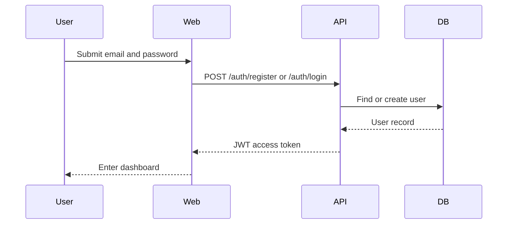
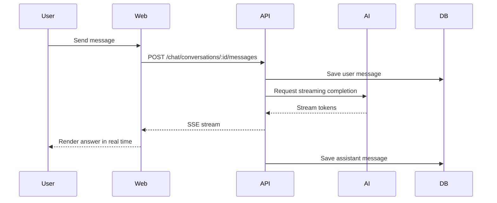
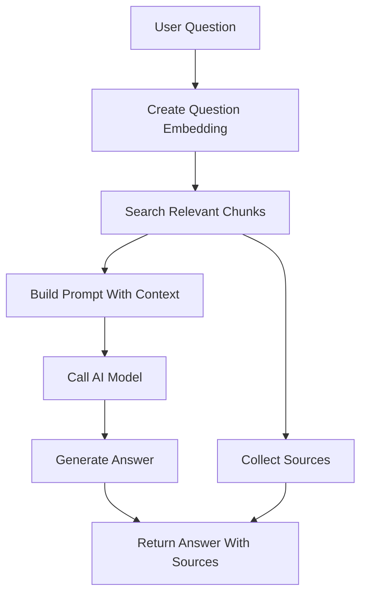

# AI 知识库助手系统架构设计

## 1. 架构目标

系统采用前后端分离的 Monorepo 架构，目标是先完成一个可本地运行、可部署、可演示的 AI 知识库 MVP，再逐步扩展 RAG、队列、缓存、对象存储和企业化能力。

架构设计原则：

- 先跑通核心业务闭环，再引入工程增强组件。
- 前端负责交互体验，后端负责业务规则、权限校验和 AI 调用。
- 数据库优先保证关系清晰和用户数据隔离。
- AI 能力分阶段演进：先普通 Chat，再知识库 RAG。

## 2. 技术栈

### Frontend

- Next.js
- React
- TypeScript
- Tailwind CSS
- shadcn/ui

### Backend

- NestJS
- Prisma
- PostgreSQL

### AI

- OpenAI 或 Claude API
- SSE Streaming
- Embedding
- Vector Search
- RAG

### Later

- Redis：缓存、限流、队列状态。
- Queue Worker：异步解析大文件和生成 Embedding。
- Object Storage：存储上传文档。
- Docker Compose：统一本地和部署环境。
- Nginx：生产环境反向代理。

## 3. Monorepo 结构

目标结构：

```text
ai-knowledge-agent
├── apps
│   ├── web
│   │   └── Next.js frontend
│   └── server
│       └── NestJS backend
├── packages
│   └── shared
│       └── shared types and utilities
├── docs
│   ├── PRD.md
│   ├── BUSINESS_MODEL.md
│   ├── ARCHITECTURE.md
│   ├── DATABASE_DESIGN.md
│   ├── MILESTONE_1_ENGINEERING_MODEL.md
│   └── MILESTONE_1_IMPLEMENTATION_PLAN.md
└── docker-compose.yml
```

`packages/shared` 只在真正需要共享类型或工具时引入，避免一开始过度抽象。

## 4. 前端模块

### 页面

第一版页面：

- `/login`：用户登录。
- `/register`：用户注册。
- `/dashboard`：知识库列表和入口。
- `/knowledge-bases/[id]`：知识库详情、文档列表、聊天入口。
- `/chat/[conversationId]`：会话详情。

### 主要职责

- 管理页面路由和登录态。
- 调用后端 API。
- 展示知识库、文档、会话和消息。
- 处理 SSE 流式响应并实时渲染 AI 回答。
- 使用 shadcn/ui 提供统一组件风格。

前端不直接访问数据库，也不直接暴露 AI Provider Key。

## 5. 后端模块

NestJS 按业务模块组织：

```text
src
├── auth
├── users
├── knowledge-bases
├── documents
├── chat
├── ai
├── prisma
└── common
```

### auth

- 注册。
- 登录。
- JWT 签发。
- JWT Guard。
- 当前用户解析。

### users

- 用户基础信息查询。
- 用户唯一性校验。

### knowledge-bases

- 创建知识库。
- 查询当前用户的知识库。
- 删除知识库。
- 校验知识库归属。

### documents

- 上传文档。
- 保存文档元数据。
- 查询文档列表。
- 删除文档。
- 更新文档处理状态。

### chat

- 创建会话。
- 保存用户消息。
- 调用 AI 服务生成回答。
- 通过 SSE 返回流式内容。
- 保存 AI 消息。
- 查询会话历史。

### ai

- 封装模型调用。
- 封装流式响应。
- 后续封装 Embedding 和 RAG 检索。

### common

- 全局异常处理。
- 请求校验。
- 分页参数。
- 当前用户装饰器。

## 6. 核心数据流

### 注册登录流程



### 普通 AI Chat 流程



### RAG 问答流程



## 7. 文件处理演进

### MVP 阶段

文件上传后先保存文件和数据库记录：

```text
upload file -> save file -> create documents row -> status = uploaded
```

这样可以先完成文档管理功能，不阻塞用户系统和聊天系统。

### RAG 阶段

文件上传后进入处理流程：

```text
upload file
-> save file
-> parse text
-> split chunks
-> create embeddings
-> save document_chunks
-> status = completed
```

如果解析失败，文档状态改为 `failed`，并记录错误原因。

### 工程化阶段

当文件较大或解析耗时明显时，引入队列：

```text
upload file
-> create document row
-> enqueue parse job
-> worker parses and embeds
-> update document status
```

## 8. 权限边界

第一版使用所有者权限模型：

- 用户只能查看自己的知识库。
- 用户只能操作自己知识库下的文档。
- 用户只能查看自己的会话和消息。
- 后端每个受保护接口都从 JWT 中获取当前用户。
- 所有资源查询都必须带上 `userId` 或通过关联关系校验归属。

暂不引入角色、组织、团队成员和共享权限。

后续如果支持知识库协作，权限模型会从所有者模型演进为成员关系模型。届时访问知识库、文档和 RAG 内容时，需要检查当前用户是否是该知识库的有效成员，以及成员角色是否允许执行查看、上传、删除或管理操作。

协作模型建议通过 `knowledge_base_members` 表承载，不直接把复杂权限塞进 `knowledge_bases` 主表。

## 9. AI 能力分阶段

### Phase 1: Basic Chat

先实现普通 AI Chat：

- 降低早期复杂度。
- 优先掌握 SSE、后端转发流、消息持久化。
- 形成可演示的 AI 交互体验。

### Phase 2: RAG

在聊天链路稳定后加入知识库上下文：

- 文档解析。
- 文本切片。
- Embedding。
- 向量检索。
- 引用来源。

### Phase 3: Production Enhancements

在核心链路稳定后加入：

- Redis 限流。
- 队列处理。
- 对象存储。
- Docker 部署。
- 日志和监控。

## 10. 部署视角

MVP 可以先本地运行：

```text
Next.js web
NestJS server
PostgreSQL
```

工程化阶段使用 Docker Compose：

```text
web
server
postgres
redis
worker
nginx
```

生产部署时，前端和后端可以独立构建。AI Provider Key、JWT Secret、数据库连接串等敏感配置通过环境变量注入。

## 11. 关键设计决策

### 为什么使用 Monorepo

前端和后端会共同演进接口、认证状态、错误格式和共享类型。Monorepo 可以让前后端在同一个仓库中同步变更，减少接口漂移，也方便后续把共享类型放入 `packages/shared`。

`packages/shared` 不在一开始承载复杂逻辑，只在接口类型、常量或通用工具确实重复时再引入。这样可以保留 Monorepo 的协作优势，同时避免过早抽象。

### 为什么 AI 调用放在后端

模型 API Key、Prompt 组装、权限校验和消息持久化都属于服务端职责。前端只负责提交用户输入和渲染流式结果，不直接访问 AI Provider。

这样设计可以：

- 避免密钥暴露到浏览器。
- 在服务端统一记录消息和 token 用量。
- 在加入 RAG 后复用同一条聊天链路。
- 在后续加入限流、审计和模型切换时保持前端稳定。

### 为什么先做普通 Chat 再做 RAG

普通 Chat 能先验证 AI 应用的基础链路：用户输入、后端调用模型、SSE 流式返回、消息持久化和历史记录。RAG 会额外引入文档解析、切片、Embedding、向量检索和引用来源，复杂度明显更高。

先完成普通 Chat，可以让聊天体验、后端流式转发和消息表设计先稳定下来。RAG 阶段只需要在同一条链路中增加知识库上下文，而不是同时处理所有不确定性。

### 为什么 Redis、队列和对象存储后置

MVP 阶段的核心目标是跑通产品闭环，PostgreSQL 和本地文件存储已经足够支撑注册、知识库、文档元数据和普通聊天。

Redis、队列和对象存储解决的是规模、稳定性和部署问题。它们适合在文档解析变慢、文件变大、接口需要限流或准备部署时引入。提前加入会增加配置和调试成本，但不会直接提升第一版核心体验。

### 为什么第一版不做多租户

多租户会引入组织、成员、角色、邀请、资源共享和权限继承。第一版先使用所有者模型，可以把权限问题收敛到“用户只能访问自己的资源”。

只要资源归属和查询边界设计清楚，后续仍然可以从 `user_id` 演进到 `organization_id` 或成员关系模型，而不需要推翻核心业务结构。

## 12. 风险与取舍

- 不过早引入 LangChain：先用模型 SDK 跑通基本链路，RAG 复杂度上来后再评估是否引入。
- 不过早引入 Redis：MVP 阶段 PostgreSQL 足够支撑核心功能。
- 不过早设计多租户：先保证单用户资源归属清晰，后续再扩展组织模型。
- 不把 RAG 放到第一步：先完成登录、知识库、聊天、历史记录，降低早期复杂度和调试成本。
