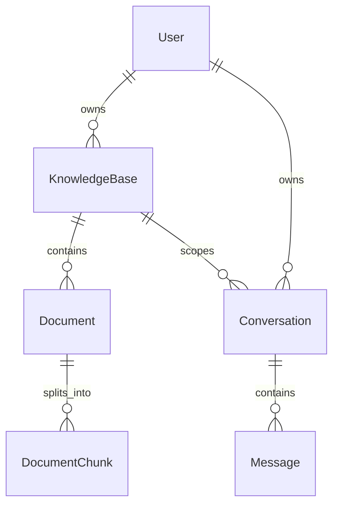

# AI 知识库助手业务模型分析

## 1. 文档目标

业务模型分析用于连接 PRD 和数据库设计。它不直接讨论具体字段类型，而是先回答：

- 系统里有哪些业务对象？
- 每个对象为什么存在？
- 对象之间是什么关系？
- 这些关系如何从产品流程中推导出来？
- 哪些对象进入 MVP，哪些对象留到后续阶段？

后续数据库设计、接口设计和模块拆分，都应该从业务模型继续推导。

## 2. 从 PRD 推导业务对象

PRD 中的核心流程包括：

1. 用户注册登录。
2. 用户创建知识库。
3. 用户上传文档。
4. 用户发起 AI 问答。
5. 系统保存聊天记录。
6. RAG 阶段基于文档内容返回带来源的回答。

从这些流程可以推导出第一版核心业务对象：

- 用户：系统的操作者和资源所有者。
- 知识库：用户管理文档和问答上下文的容器。
- 文档：知识库中的原始资料。
- 会话：一次连续问答的上下文。
- 消息：会话中的用户输入和 AI 回复。
- 文档切片：RAG 阶段用于检索的文档片段。

## 3. 业务对象说明

### 用户

用户是系统的操作者，也是第一版资源归属的根。

来自 PRD 的依据：

- 用户需要注册。
- 用户需要登录。
- 用户需要创建知识库。
- 用户需要上传文档。
- 用户需要发起聊天。

因此，用户是独立实体，后续对应 `users` 表。

第一版不单独设计管理员实体。管理员能力会引入用户管理、后台权限和审计范围，不属于 MVP 核心闭环。

### 知识库

知识库是用户组织资料的业务容器。

来自 PRD 的依据：

- 用户需要创建知识库。
- 用户需要查看知识库。
- 用户需要删除知识库。
- 文档需要归属到某个知识库。
- RAG 问答需要知道使用哪个知识库作为上下文。

因此，知识库是独立实体，后续对应 `knowledge_bases` 表。

知识库属于用户，关系是：

```text
User 1:N KnowledgeBase
```

这是 MVP 的简化模型，表示一个知识库先由一个创建者拥有和管理。

真实协作场景中，知识库可能被多个用户共同维护或查看，例如 A 创建知识库后邀请 B 编辑、邀请 C 只读查看。此时用户和知识库会演进为多对多关系：

```text
User N:M KnowledgeBase
```

多对多关系不应直接用简单关联表达，而应通过成员关系对象承载权限和邀请状态：

```text
User 1:N KnowledgeBaseMember
KnowledgeBase 1:N KnowledgeBaseMember
```

`KnowledgeBaseMember` 不进入 MVP，但后续协作阶段会用于表达：

- 谁可以访问某个知识库。
- 谁可以维护某个知识库。
- 谁只能查看某个知识库。
- 谁发起了邀请。
- 邀请是否已接受。

### 文档

文档是知识库中的原始资料。

来自 PRD 的依据：

- 用户需要上传文件。
- 用户需要查看文件列表。
- 用户需要删除文件。
- RAG 阶段需要从文档中解析文本。

因此，文档是独立实体，后续对应 `documents` 表。

文档属于知识库，关系是：

```text
KnowledgeBase 1:N Document
```

文档不直接归属于用户，而是通过知识库间接归属用户。这样可以避免重复保存所有者信息，也能让权限校验从知识库统一进入。

### 会话

会话表示一次连续问答的上下文。

来自 PRD 的依据：

- 用户需要发起聊天。
- 用户下次打开需要看到历史记录。
- 普通 Chat 和 RAG Chat 都需要保存上下文。

因此，会话是独立实体，后续对应 `conversations` 表。

会话属于用户，关系是：

```text
User 1:N Conversation
```

会话可以选择绑定知识库：

```text
KnowledgeBase 1:N Conversation
```

当会话没有绑定知识库时，它表示普通 AI Chat；当会话绑定知识库时，它表示基于该知识库的 RAG Chat。

### 消息

消息是会话中的最小内容单位。

来自 PRD 的依据：

- 用户会发送问题。
- AI 会返回回答。
- 系统需要保存聊天记录。
- 后续需要展示历史消息。

因此，消息是独立实体，后续对应 `messages` 表。

消息属于会话，关系是：

```text
Conversation 1:N Message
```

消息需要区分角色：

```text
user
assistant
system
```

这样可以在同一张表中保存用户输入、AI 回复和系统上下文。

### 文档切片

文档切片是 RAG 阶段的检索单元。

来自 PRD 的依据：

- RAG 需要解析文档文本。
- 长文档不能整体放入 Prompt。
- 系统需要检索与用户问题相关的局部内容。
- AI 回答需要展示引用来源。

因此，文档切片是独立实体，后续对应 `document_chunks` 表。

文档切片属于文档，关系是：

```text
Document 1:N DocumentChunk
```

MVP 前期可以先不实现文档切片，但数据库设计需要预留它，因为它是 RAG 能力的核心对象。

## 4. 核心关系汇总



## 5. 从业务对象到数据库表

业务对象和数据库表的对应关系：

```text
用户       -> users
知识库     -> knowledge_bases
文档       -> documents
会话       -> conversations
消息       -> messages
文档切片   -> document_chunks
知识库成员 -> knowledge_base_members（后续协作阶段）
```

推导原则：

- 需要独立生命周期的对象，应该成为独立表。
- 存在一对多关系的对象，通常需要通过外键表达关系。
- 只作为展示属性的内容，不急着拆成独立表。
- 后续阶段才需要的对象，可以先在设计中预留，但不阻塞 MVP。

## 6. 权限边界推导

第一版权限从用户出发：

```text
User
-> KnowledgeBase
-> Document
-> DocumentChunk
```

以及：

```text
User
-> Conversation
-> Message
```

因此，权限规则可以简化为：

- 用户只能访问自己的知识库。
- 用户只能访问自己知识库下的文档。
- 用户只能访问自己的会话。
- 用户只能访问自己会话下的消息。

这个模型不需要角色表，也不需要组织表，就能支撑 MVP 的资源隔离。

后续进入知识库协作阶段后，权限入口会从单一所有者模型演进为成员关系模型：

```text
User
-> KnowledgeBaseMember
-> KnowledgeBase
-> Document
-> DocumentChunk
```

届时权限判断不再只看 `knowledge_bases.user_id`，而是需要检查当前用户是否是该知识库的有效成员，以及成员角色是否允许执行当前操作。

## 7. 暂不进入 MVP 的对象

以下对象暂不进入 MVP：

- 组织：会引入多租户和成员关系。
- 知识库成员：会引入邀请、协作角色和资源级权限。
- 角色：会引入复杂 RBAC。
- 权限策略：会引入资源级授权模型。
- 支付订单：不属于知识库核心闭环。
- 工作流任务：不属于第一版 AI 问答闭环。
- 审计日志：适合在企业化阶段再加入。

这些对象不是永远不做，而是后续阶段根据 Roadmap 引入。

## 8. 对后续设计的影响

业务模型确定后，后续设计应按以下顺序继续：

```text
PRD
-> 业务模型分析
-> 数据库设计
-> 接口设计
-> 前后端实现
-> 验证与复盘
```

在进入代码实现前，应先确认当前 Milestone 的业务对象、对象关系和边界是否清楚。
