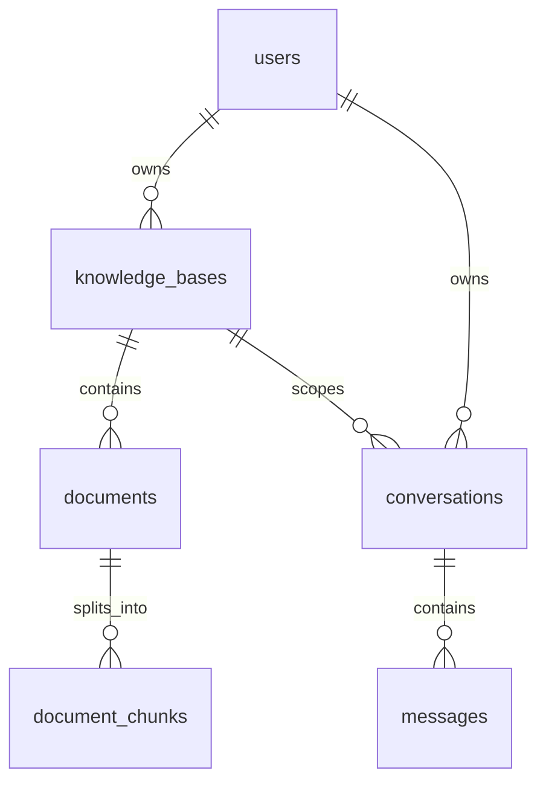

# AI 知识库助手数据库设计

## 1. 设计目标

数据库第一版使用 PostgreSQL 和 Prisma，目标是支撑 MVP 的用户、知识库、文档和聊天历史功能，同时为后续 RAG 留出清晰扩展点。

本设计基于 `docs/BUSINESS_MODEL.md` 中的业务对象和关系推导，不直接从页面或接口反推数据表。

设计原则：

- 每张表只承担一个明确职责。
- 所有用户资源都能追溯到所有者。
- 先用简单关系表达业务，不提前设计复杂多租户。
- RAG 数据独立建模，避免污染文档主表。

## 2. 实体关系概览



## 3. MVP 表

### users

用户账号表。

字段：

```text
id              uuid primary key
email           varchar unique not null
password_hash   varchar not null
created_at      timestamp not null
updated_at      timestamp not null
```

说明：

- `email` 用于登录，必须唯一。
- `password_hash` 只保存加密后的密码，不保存明文密码。
- `created_at` 和 `updated_at` 用于审计和排序。

索引：

```text
unique index users_email_unique on users(email)
```

### knowledge_bases

知识库表。

字段：

```text
id           uuid primary key
user_id      uuid not null references users(id)
name         varchar not null
description  text null
created_at   timestamp not null
updated_at   timestamp not null
deleted_at   timestamp null
```

说明：

- `user_id` 表示知识库所有者。
- `description` 用于补充知识库用途。
- `deleted_at` 用于软删除，避免误删后数据不可恢复。

索引：

```text
index knowledge_bases_user_id_idx on knowledge_bases(user_id)
index knowledge_bases_user_id_deleted_at_idx on knowledge_bases(user_id, deleted_at)
```

业务规则：

- 查询知识库列表时只返回当前用户 `user_id` 匹配且 `deleted_at` 为空的数据。
- 删除知识库时优先软删除。

### documents

文档元数据表。

字段：

```text
id                  uuid primary key
knowledge_base_id   uuid not null references knowledge_bases(id)
filename            varchar not null
mime_type           varchar not null
storage_key         varchar not null
size_bytes          integer not null
status              varchar not null
error_message       text null
created_at          timestamp not null
updated_at          timestamp not null
deleted_at          timestamp null
```

说明：

- `knowledge_base_id` 表示文档所属知识库。
- `storage_key` 表示文件在本地或对象存储中的路径标识。
- `status` 表示处理状态。
- `error_message` 用于记录解析失败原因。

状态建议：

```text
uploaded
processing
completed
failed
```

索引：

```text
index documents_knowledge_base_id_idx on documents(knowledge_base_id)
index documents_status_idx on documents(status)
```

业务规则：

- 上传文档前必须校验知识库属于当前用户。
- 删除文档前必须通过知识库关系校验用户归属。
- MVP 可以只保存文件和元数据，RAG 阶段再处理文本。

### conversations

会话表。

字段：

```text
id                  uuid primary key
user_id             uuid not null references users(id)
knowledge_base_id   uuid null references knowledge_bases(id)
title               varchar null
created_at          timestamp not null
updated_at          timestamp not null
deleted_at          timestamp null
```

说明：

- `user_id` 表示会话所有者。
- `knowledge_base_id` 为空时表示普通 AI Chat。
- `knowledge_base_id` 不为空时表示基于某个知识库的 RAG Chat。
- `title` 可以由第一条用户消息生成，或者后续由 AI 自动总结。

索引：

```text
index conversations_user_id_idx on conversations(user_id)
index conversations_knowledge_base_id_idx on conversations(knowledge_base_id)
```

业务规则：

- 用户只能查看自己的会话。
- 如果会话绑定知识库，必须确保知识库也属于该用户。

### messages

消息表。

字段：

```text
id               uuid primary key
conversation_id  uuid not null references conversations(id)
role             varchar not null
content          text not null
metadata         jsonb null
created_at       timestamp not null
```

说明：

- `role` 表示消息来源。
- `content` 保存完整消息内容。
- `metadata` 可用于保存 token 用量、模型名称、引用来源快照等扩展信息。

角色建议：

```text
user
assistant
system
```

索引：

```text
index messages_conversation_id_created_at_idx on messages(conversation_id, created_at)
```

业务规则：

- 发送消息前必须校验会话属于当前用户。
- AI 流式回答过程中可以先在内存拼接完整内容，完成后再写入 `messages`。

## 4. RAG 预留表

### document_chunks

文档切片表。

字段：

```text
id            uuid primary key
document_id   uuid not null references documents(id)
chunk_index   integer not null
content       text not null
embedding     vector null
token_count   integer null
metadata      jsonb null
created_at    timestamp not null
```

说明：

- `document_id` 表示 chunk 来源文档。
- `chunk_index` 表示该 chunk 在原文中的顺序。
- `content` 保存切片文本。
- `embedding` 后续可使用 pgvector 存储。
- `metadata` 可保存页码、段落、标题等引用信息。

索引：

```text
index document_chunks_document_id_idx on document_chunks(document_id)
unique index document_chunks_document_id_chunk_index_unique on document_chunks(document_id, chunk_index)
```

向量索引在引入 pgvector 后补充，例如 HNSW 或 IVFFlat。

## 5. 权限查询模式

第一版没有组织和角色，权限核心是所有者校验。

### 查询知识库

```text
where knowledge_bases.id = :knowledgeBaseId
and knowledge_bases.user_id = :currentUserId
and knowledge_bases.deleted_at is null
```

### 查询文档

文档本身没有 `user_id`，通过知识库关联校验：

```text
documents
join knowledge_bases on documents.knowledge_base_id = knowledge_bases.id
where documents.id = :documentId
and knowledge_bases.user_id = :currentUserId
and documents.deleted_at is null
```

### 查询会话

```text
where conversations.id = :conversationId
and conversations.user_id = :currentUserId
and conversations.deleted_at is null
```

这个模式能避免前端传入任意 ID 访问其他用户数据。

## 6. 删除策略

建议第一版使用软删除：

- `knowledge_bases.deleted_at`
- `documents.deleted_at`
- `conversations.deleted_at`

`messages` 和 `document_chunks` 可以先不单独软删除，跟随上级资源处理。

软删除的好处：

- 降低误删风险。
- 方便后续做回收站或审计。
- 保留用户资产的数据生命周期。

## 7. Prisma 建模注意点

后续写 Prisma Schema 时建议：

- 使用 `@default(uuid())` 生成主键。
- 使用 `@createdAt` 和 `@updatedAt` 维护时间。
- 使用枚举表达 `DocumentStatus` 和 `MessageRole`。
- 使用关系字段表达 `User -> KnowledgeBase`、`KnowledgeBase -> Document`、`Conversation -> Message`。
- 查询时优先通过 service 层封装所有者校验，不把权限判断散落到 controller。

## 8. 后续演进

### 知识库协作

如果后续支持邀请其他用户共同维护或查看知识库，需要增加知识库成员表：

```text
knowledge_base_members
```

建议字段：

```text
id                 uuid primary key
knowledge_base_id  uuid not null references knowledge_bases(id)
user_id            uuid not null references users(id)
role               varchar not null
status             varchar not null
invited_by         uuid null references users(id)
created_at         timestamp not null
updated_at         timestamp not null
removed_at         timestamp null
```

角色建议：

```text
owner
admin
editor
viewer
```

状态建议：

```text
pending
active
removed
```

索引建议：

```text
unique index knowledge_base_members_kb_user_unique on knowledge_base_members(knowledge_base_id, user_id)
index knowledge_base_members_user_id_idx on knowledge_base_members(user_id)
index knowledge_base_members_knowledge_base_id_idx on knowledge_base_members(knowledge_base_id)
```

协作阶段的关系会从：

```text
users 1:N knowledge_bases
```

演进为：

```text
users 1:N knowledge_base_members
knowledge_bases 1:N knowledge_base_members
```

这不是 MVP 必需表。第一版先保留 `knowledge_bases.user_id` 作为创建者和所有者，后续再通过成员表表达协作访问。

### 多租户

如果后续加入企业组织，需要增加：

```text
organizations
organization_members
```

并将 `knowledge_bases.user_id` 演进为 `owner_user_id` 或 `organization_id`。

### 队列

如果文档解析异步化，可以增加：

```text
document_jobs
```

也可以先使用 Redis 队列，不一定需要单独建任务表。

### 引用来源

引用来源可以先放在 `messages.metadata` 中：

```json
{
  "sources": [
    {
      "documentId": "uuid",
      "chunkId": "uuid",
      "filename": "handbook.pdf",
      "page": 3
    }
  ]
}
```

当引用、反馈、评分变复杂后，再拆出独立引用表。

## 9. 设计依据

### 为什么第一版不做多租户

第一版的核心目标是跑通用户、知识库、文档和聊天链路。多租户会带来组织、成员、邀请、角色、资源共享和权限继承，这些能力会显著增加数据模型和接口复杂度。

当前使用 `users -> knowledge_bases` 的所有者模型，可以先把权限边界收敛为“用户只能访问自己的资源”。这个模型足够支撑 MVP，也能为后续组织模型保留演进空间。

### 为什么 `knowledge_bases` 直接关联 `users`

知识库是第一版的核心资源容器。把 `user_id` 放在 `knowledge_bases` 上，可以让所有上层权限判断从知识库归属开始。

这样设计有两个好处：

- 查询知识库列表时可以直接按当前用户过滤。
- 文档、RAG chunk、知识库会话都可以通过知识库关系间接校验归属。

后续如果加入组织，可以将知识库所有权从 `user_id` 演进为 `organization_id`，或同时保留 `owner_user_id` 作为创建者字段。

如果先加入知识库协作，但暂不引入组织，可以保留 `knowledge_bases.user_id` 作为创建者字段，并增加 `knowledge_base_members` 表表达成员访问关系。这样可以支持邀请协作者和只读成员，而不需要立刻引入完整多租户模型。

### 为什么 `documents` 不直接保存 `user_id`

文档天然属于某个知识库，而知识库已经属于某个用户。如果 `documents` 同时保存 `user_id`，会产生冗余归属字段：当文档的 `knowledge_base_id` 和 `user_id` 不一致时，系统需要额外处理数据不一致问题。

通过 `documents -> knowledge_bases -> users` 校验权限，关系更清晰，也能保证文档始终被知识库上下文管理。

### 为什么 `document_chunks` 单独建表

`documents` 表保存文档元数据，`document_chunks` 保存可检索的文本片段和向量数据。两者生命周期和查询方式不同：

- 文档列表只需要文件名、大小、状态等元数据。
- RAG 检索需要按 chunk 做向量搜索和上下文拼接。
- 同一份文档会拆成多个 chunk，属于典型的一对多关系。

把 chunk 独立出来，可以避免文档主表变得臃肿，也方便后续重建 embedding、调整 chunk 策略或增加向量索引。

### 为什么 `conversations.knowledge_base_id` 可以为空

系统需要同时支持普通 AI Chat 和基于知识库的 RAG Chat。

当 `knowledge_base_id` 为空时，会话表示普通 Chat；当它不为空时，会话绑定某个知识库，后续回答可以使用该知识库的文档上下文。

这个设计避免拆出两套会话表，也让前端和后端可以复用同一套消息历史、流式响应和会话查询逻辑。

### 为什么引用来源先放在 `messages.metadata`

引用来源一开始只服务于回答展示，通常包含文档 ID、chunk ID、文件名、页码等快照信息。放在 `messages.metadata` 中，可以让一条 AI 消息保留当时生成答案所依据的来源。

第一版不单独建引用表，是因为引用还没有复杂到需要独立查询、评分、反馈或审计。当引用来源需要被单独管理时，再拆出独立表会更合适。

### 为什么使用软删除

知识库、文档和会话都属于用户资产，直接物理删除会增加误删风险，也不利于后续审计、恢复或异步清理文件。

第一版使用 `deleted_at` 可以保持查询简单：

- 正常列表只查询 `deleted_at is null`。
- 删除操作只更新时间戳。
- 后续可以增加后台任务清理文件和 chunk。

`messages` 和 `document_chunks` 暂时不单独软删除，是因为它们依附于上级资源，第一版可以跟随知识库、文档或会话的状态处理。

### 核心取舍总结

- 第一版不做多租户，先用所有者模型保证资源隔离。
- 知识库协作会通过 `knowledge_base_members` 扩展为多对多关系，但不进入 MVP。
- 文档表只保存元数据，RAG chunk 单独建表。
- 会话可以为空知识库，支持普通 Chat 和 RAG Chat 两种模式。
- 引用来源先存 metadata，复杂后再拆表。
- 知识库、文档和会话属于用户资产，适合使用软删除。
